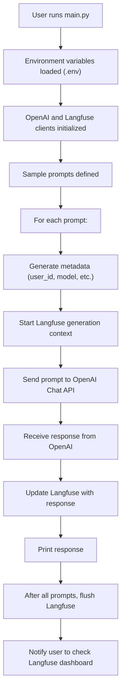

# Langfuse Advanced Tracking

Langfuse Advanced Tracking is a Python project that demonstrates advanced tracking and metadata logging for OpenAI chat completions using the Langfuse observability platform. It showcases how to track custom metadata for each prompt and response, and how to integrate Langfuse with OpenAI's API for better monitoring and debugging of LLM-powered applications.

## Features
- Tracks custom metadata (user, model, temperature, etc.) for each chat request
- Integrates with OpenAI's Chat API
- Uses Langfuse for observability and tracking
- Demonstrates parameter variation and session tracking
- Simple CLI interface for demonstration

## Project Structure
- `main.py`: Main script with all logic
- `assets/screenshot.png`: Example screenshot of the app in action
- `.env`: Environment variables (not included in repo)
- `requirements.txt`: Python dependencies

## Setup
1. **Clone the repository**
    ```bash
    git clone https://github.com/nishanttomar21/langfuse-advanced-tracking.git
    cd langfuse-advanced-tracking
    ```
2. **Install dependencies:**
   ```bash
   pip install -r requirements.txt
   ```
3. **Set up your `.env` file** with the following variables:
   ```env
   OPENAI_API_KEY=your_openai_key
   LANGFUSE_PUBLIC_KEY=your_langfuse_public_key
   LANGFUSE_SECRET_KEY=your_langfuse_secret_key
   LANGFUSE_HOST=https://cloud.langfuse.com
   ```
4. **Run the script:**
   ```bash
   python main.py
   ```

## Usage
- The script will run several sample prompts, log metadata and responses to Langfuse, and print results to the console.
- After completion, check your Langfuse dashboard for tracked generations and metadata.

## Example Screenshot


## Flow Diagram



## License

This project is licensed under the MIT License. See the [LICENSE](LICENSE) file for details.
